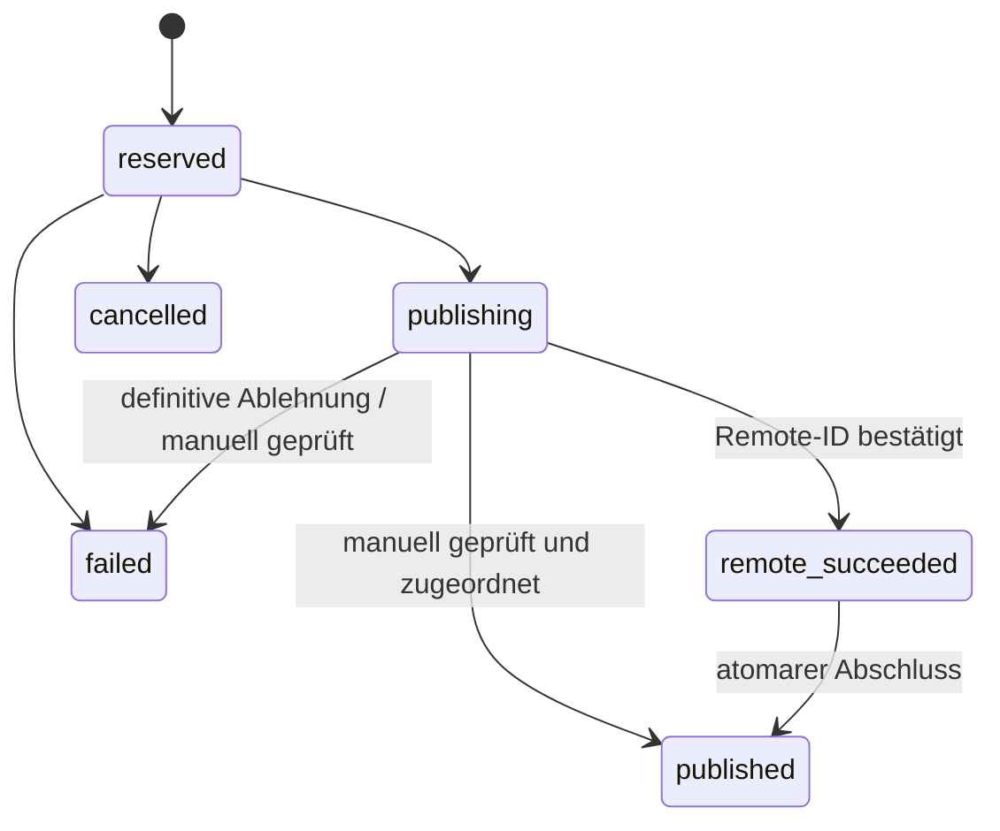

# Kulturbytes Social

Kulturbytes-Termine auf Facebook Pages, Instagram und Mastodon veröffentlichen.
Kulturbytes bleibt die Quelle für Eventdaten. Das FastAPI-Backend übernimmt Auswahlregeln,
Vorschau, Veröffentlichung und Journal; die Click-CLI ist ein HTTP-Client.
**PostgreSQL ist die einzige persistente Datenbank.**

## Installation und Start

Voraussetzungen: Python ≥ 3.12, `uv`, ein erreichbarer PostgreSQL-Server und eine eigene
Datenbank mit einer Rolle, die Tabellen und Indizes anlegen darf. PostgreSQL kann lokal
oder auf einem Server laufen; Docker ist nicht erforderlich.

```bash
uv sync --all-packages
createdb kulturbytes_social
cp .env.example .env
chmod 600 .env
```

In `.env` die Verbindung und einen starken, selbst generierten Service-Token setzen:

```dotenv
DATABASE_URL=postgresql+psycopg://localhost/kulturbytes_social
KULTURBYTES_SOCIAL_API_URL=http://127.0.0.1:8000
KULTURBYTES_SOCIAL_API_TOKEN=
```

Das leere Token-Feld muss vor der Nutzung gefüllt werden. Für passwortgeschützte Verbindungen
Benutzer und Passwort in `DATABASE_URL` konfigurieren; Sonderzeichen URL-kodieren.
Die vollständige Verbindungs-URL niemals in Logs, Issues oder Screenshots übernehmen.

```bash
uv run alembic upgrade head
uv run uvicorn kulturbytes_social.api.app:app --host 127.0.0.1 --port 8000
```

In einem zweiten Terminal:

```bash
curl --fail http://127.0.0.1:8000/health
curl --fail http://127.0.0.1:8000/api/v1/health
uv run kulturbytes-social --help
uv run kulturbytes-social mastodon
```

`/health` prüft nur den Prozess. `/api/v1/health` prüft die PostgreSQL-Tabellen und liefert
bei fehlendem Schema oder Verbindungsproblemen HTTP 503. Es findet keine automatische
Schemaerstellung statt. App-Import und CLI-Hilfe benötigen keine laufende Datenbank.

## Konfiguration und Betrieb

Nichtleere Werte aus `.env` haben Vorrang vor Prozessvariablen. Für Plattform-Secrets
folgt danach der OS-Keyring. Ein explizit leerer Prozesswert unterdrückt den Keyring-Lookup.
Im Checkout liegt `.env` im Repository-Stamm, unabhängig vom Arbeitsverzeichnis;
installiert außerhalb eines Checkouts unter `$XDG_CONFIG_HOME/kulturbytes-social/.env`
oder `~/.config/kulturbytes-social/.env`.

| Einstellung | Ort | Bedeutung |
| --- | --- | --- |
| `DATABASE_URL` | Backend/Alembic | Ausschließlich `postgresql+psycopg://…`; kein Ersatzspeicher |
| `KULTURBYTES_SOCIAL_API_TOKEN` | Backend und CLI | Gemeinsamer Bearer-Service-Token |
| `KULTURBYTES_SOCIAL_API_URL` | CLI | Backend-Adresse, Standard `http://127.0.0.1:8000` |
| Plattform-Zugangsdaten | Backend | Siehe Plattform-READMEs |
| `TEST_DATABASE_URL` | Tests | Separate PostgreSQL-Datenbank mit Namen auf `_test` |

Die CLI benötigt für Laufzeitoperationen nur API-Adresse und API-Token. Der Server löst
Plattform-Zugänge auf; API-Requests enthalten keine Social-Tokens. Authentifizierung im
Server ist nicht interaktiv. Ein erfolgreich geprüfter Meta-Zugang aus Environment/Keyring
kann serverseitig in `.env` gespeichert werden, entsprechend der bestehenden Zugangspolitik.

Alle Geschäfts-Endpunkte unter `/api/v1` sind geschützt, einschließlich Vorschau und
Journal-Lesezugriff. Die beiden Health-Endpunkte sind öffentlich. Die Prüfung verwendet
`secrets.compare_digest`; ein fehlendes Server-Token verweigert den Zugriff.
OpenAPI unter `/docs` beschreibt Bearer-Authentifizierung und Request-Modelle.
Es gibt keine Benutzerkonten oder Rollen; der Service-Token gewährt administrative Rechte.

Standardmäßig nur auf Loopback binden. Für Fernzugriff HTTPS über einen geeigneten
Reverse-Proxy verwenden und Proxy-/Anwendungslogs ohne Tokens, Header und Request-Bodies
betreiben. Mutierende Requests dürfen auch durch einen Proxy nicht automatisch wiederholt
werden. Synchronous Publishing kann durch Instagram-Polling mehrere Minuten dauern;
entsprechende Proxy-Timeouts setzen. Die CLI wartet bis zu 600 Sekunden auf eine Antwort.

## CLI

```bash
uv run kulturbytes-social facebook
uv run kulturbytes-social instagram --city Flensburg --limit 20
uv run kulturbytes-social mastodon --publish
uv run kulturbytes-social facebook --check-auth
uv run kulturbytes-social instagram --event-uuid EVENT_UUID --date-identifier DATE_SLUG
uv run kulturbytes-social mastodon --event-uuid EVENT_UUID --date-identifier DATE_UUID --publish
```

Ohne `--publish` wird nur eine Vorschau erstellt. Interaktiv funktionieren `2`, `1,4,7`,
`3-6`, `1,3-5,9`, `all`, `alle` und `*`; eine leere Auswahl beendet den Lauf.
`--city` vergleicht exakt und ohne Beachtung der Groß-/Kleinschreibung.
`--limit` ist standardmäßig 50, maximal 1000; `0` zeigt alle Kandidaten.
Direkte Auswahl löst UUID plus Termin-Slug oder Termin-UUID vor jeder Listenbegrenzung auf.

Jede tatsächliche Veröffentlichung benötigt eine lokale Bestätigung. Bereits publizierte
Termine erfordern `--include-published` und eine zusätzliche Bestätigung, auch in der
Vorschau. Aktive oder ungeklärte Versuche bleiben unabhängig davon gesperrt. Die CLI sendet
den Hash der bestätigten Vorschau; geänderter Text führt zum Konflikt statt Veröffentlichung.

Fehler bei direkter Auswahl/Veröffentlichung liefern einen Fehler-Exitcode. Bei mehreren
manuell ausgewählten Terminen werden die übrigen weiterbearbeitet, danach wird ein Fehler
zurückgegeben, wenn mindestens einer scheiterte. Backend-Ausfall erlaubt keine lokale
Veröffentlichung. Vor Wiederholung einer Anfrage mit unklarer Antwort das Journal prüfen.

Lokale OS-Keyring-Verwaltung bleibt für Backend-Betreiber verfügbar:

```bash
uv run kulturbytes-social facebook --credentials set
uv run kulturbytes-social instagram --credentials status
uv run kulturbytes-social mastodon --credentials delete
```

Diese Befehle verwalten den Keyring auf dem ausführenden Rechner. Auf einem entfernten
CLI-Rechner ändern sie keine Backend-Zugangsdaten. Facebooks `--resolve-page-token`
verwendet den serverseitigen Check, der einen fehlenden/ungültigen Page-Zugang bei
verfügbaren passenden Meta-Zugangsdaten auflösen kann.

## API

| Methode | Pfad | Verhalten |
| --- | --- | --- |
| GET | `/health` | Prozess lebt |
| GET | `/api/v1/health` | PostgreSQL-Bereitschaft |
| GET | `/api/v1/events` | Gefilterte Termine; `platform` erforderlich |
| GET | `/api/v1/events/{event_uuid}/dates/{date_identifier}` | Eindeutige Auswahl mit Detailanreicherung |
| POST | `/api/v1/publications/preview` | Vorschau, Bild-URL und Inhaltshash; keine Journal-Schreibzugriffe |
| POST | `/api/v1/publications` | Einen Termin synchron veröffentlichen |
| GET | `/api/v1/publications` | Historie, Filter `platform`, `date_uuid`, `limit` |
| GET | `/api/v1/publications/{id}` | Bestätigte Veröffentlichung |
| GET | `/api/v1/publication-attempts` | Filter `platform`, `date_uuid`, `state`, `active`, `limit` |
| GET | `/api/v1/publication-attempts/{id}` | Journal mit Phase und Remote-ID |
| POST | `/api/v1/publication-attempts/{id}/resolve` | Bestätigte manuelle Auflösung |
| POST | `/api/v1/platforms/{platform}/check-auth` | Ausschließlich lesende Social-API-Prüfung |
| POST | `/api/v1/jobs` | Publikationsjob anlegen und synchron ausführen |
| GET | `/api/v1/jobs` | Jobs; Filter `state`, `limit` |
| GET | `/api/v1/jobs/{id}` | Job einschließlich Ergebnis |
| POST | `/api/v1/jobs/{id}/cancel` | Nur noch wartende Jobs abbrechen |

Beispiel für Vorschau, Veröffentlichung oder Job:

```json
{"platform": "mastodon", "event_uuid": "EVENT_UUID", "date_identifier": "DATE_UUID", "force_repeat": false}
```

Optional: `city`; beim Publizieren `expected_content_sha256` aus der Vorschau.
Unbekannte Request-Felder werden abgelehnt. Die API selbst hat keinen Bestätigungsdialog:
ein authentifizierter POST autorisiert die einzelne Veröffentlichung; `force_repeat: true`
autorisiert die Wiederholung. API-Clients müssen passende Bestätigungen anbieten.

Fehlerantworten enthalten `detail.code`, eine sichere `detail.message` und gegebenenfalls
`attempt_id`/`remote_id`. Status: 401 Zugang verweigert, 404 nicht gefunden, 409 Konflikt,
422 ungültige Daten, 502 Plattformfehler/unklares Remote-Ergebnis, 503 Datenbank oder lokale
Finalisierung fehlgeschlagen. Unvorhergesehene Fehler werden als bereinigtes HTTP 500 gemeldet.
Jede Antwort erhält eine serverseitig erzeugte `X-Request-ID`.

## Datenbank und Wiederherstellung

Alembic-Revision `0001_postgresql` erstellt `publication_attempts`, `publications` und `jobs`.
IDs sind PostgreSQL-UUIDs, Jobdaten JSONB, Zeitstempel TIMESTAMPTZ in UTC. Kulturbytes-Zeiten
werden weiterhin in `Europe/Berlin` interpretiert. Event- und Termin-IDs bleiben opaque Strings.



Ein partieller Unique-Index erlaubt höchstens einen aktiven Versuch je Plattform und
`date_uuid` (`reserved`, `publishing`, `remote_succeeded`). Kurze transaktionale Advisory
Locks serialisieren zusätzlich die Prüfung der Historie mit Reservierung/Finalisierung.
Netzwerkzugriffe laufen außerhalb jeder Datenbanktransaktion. Der Schutz funktioniert
über mehrere Backend-Prozesse hinweg; es gibt keinen Prozess-Lock als Publikationssperre.

Vor jedem Social-POST werden Phase, Ziel und SHA-256 des tatsächlich versandten Texts
journalisiert. Nach bestätigtem Erfolg wird `remote_succeeded` samt Remote-ID separat
committed, bevor die Historienzeile und `published` atomar geschrieben werden.
Explizite Wiederholungen erzeugen neue Historienzeilen. Transportfehler oder fehlende
Remote-ID lassen den Versuch gesperrt; POSTs werden nie automatisch wiederholt.

```bash
uv run kulturbytes-social attempts list --platform instagram --active
uv run kulturbytes-social attempts resolve ATTEMPT_UUID --platform instagram --outcome published --remote-id REMOTE_ID
uv run kulturbytes-social attempts resolve ATTEMPT_UUID --platform instagram --outcome failed
```

Vor Auflösung den ausführenden Publisher stoppen und das Ergebnis auf der Plattform
manuell prüfen. Die CLI verlangt dafür eine ausdrückliche Bestätigung. Über die API ist
`confirmed: true` erforderlich. `published` repariert den Abschluss ohne erneute Social-Anfrage;
eine bereits gespeicherte Remote-ID darf nicht ersetzt werden. `failed` gibt nur `reserved`
oder `publishing` frei; `cancelled` nur `reserved`. Eine bestätigte Remote-Veröffentlichung
kann nicht durch `failed` freigegeben werden. Es gibt keinen automatischen Ablauf alter Sperren.

Jobs verwenden `queued → running → succeeded/failed`. Ein Prozessabbruch kann einen Job
in `running` belassen; Journal und Plattform vor einem erneuten Auftrag prüfen. Es gibt
keine Hintergrund-Queue, keinen Scheduler und keine automatische Wiederaufnahme.

## Cutover

Alle alten Publisher-Prozesse vor dem Wechsel stoppen. Die neue PostgreSQL-Datenbank
mit Alembic vorbereiten, Backend konfigurieren, Readiness und Vorschauen prüfen, dann
Veröffentlichungen aufnehmen. Ohne Historie gelten frühere Veröffentlichungen als unbekannt;
die erste Auswahl deshalb anhand der bestehenden Plattform-Beiträge prüfen.

Alte lokale Bestandsdaten werden weder gelesen noch übernommen. Das Projekt bietet keinen
Importer, keinen Kompatibilitätsadapter und keinen alternativen persistenten Speicher.
Eine benötigte Übernahme historischer Daten liegt vollständig außerhalb dieses Projekts.
Vorhandene lokale Dateien werden nicht gelöscht, umbenannt oder verändert.

## Tests

Unit- und HTTP-Client-Tests laufen ohne Datenbank; PostgreSQL-Integrationstests werden ohne
explizite Testkonfiguration als übersprungen gemeldet:

```bash
uv sync --all-packages
uv run --all-packages python -m unittest discover -s tests -v
```

Für die vollständige Prüfung eine **eigene** Datenbank verwenden. Der Testlauf migriert und
leert deren drei Anwendungstabellen. Er akzeptiert nur `TEST_DATABASE_URL` mit dem Treiber
`postgresql+psycopg` und einem Datenbanknamen, der auf `_test` endet; niemals Produktionsdaten
unter diesem Namen betreiben. Die Tests verwenden nicht die Backend-Verbindung aus `.env`.

```bash
createdb kulturbytes_social_test
export TEST_DATABASE_URL='postgresql+psycopg://localhost/kulturbytes_social_test'
uv run --all-packages python -m unittest discover -s tests -v
```

Die Integrationstests prüfen native Datentypen, Alembic, konkurrierende Verbindungen,
atomaren Rollback, Wiederholungen, Remote-Teilerfolg, API-Schutz und echte Adaptersequenzen
mit simulierten HTTP-Antworten. Es gibt keine Live-Veröffentlichungen oder echten Bildabrufe.

## Pakete und Plattformen

`src/kulturbytes_social/`: API-Routen, Services, DB-Modelle/Repositories und HTTP-CLI.
`common/`: Kulturbytes-Validierung, Text-/Medienhilfen, Credentials und HTTP-Sicherheit.
`facebook/`, `instagram/`, `mastodon/`: Plattformadapter und abschließende Textformatierung.
Der einzige CLI-Einstieg bleibt `kulturbytes-social`; keine plattformspezifischen Skript-Wrapper.

Details und vorhandene Plattformgrenzen: [Facebook](facebook/README.md),
[Instagram](instagram/README.md), [Mastodon](mastodon/README.md).

## Backup und Restore

Standardwerkzeuge von PostgreSQL verwenden, mit passenden `PGHOST`, `PGPORT`, `PGUSER`
und sicher hinterlegtem Passwort (z. B. `.pgpass` mit Modus 0600). Die SQLAlchemy-URL mit
`+psycopg` ist kein direktes Verbindungsargument für diese Programme.

```bash
pg_dump --format=custom --file=kulturbytes-social.dump kulturbytes_social
createdb kulturbytes_social_restore
pg_restore --no-owner --dbname=kulturbytes_social_restore kulturbytes-social.dump
```

Backups enthalten Journal und Publikationshistorie und gehören außerhalb des Repositories
in den geschützten Betriebs-Backup-Speicher. Wiederherstellung zuerst auf eine neue Datenbank
prüfen. Vor produktivem Wechsel alle Publisher stoppen; ein älteres Backup kann inzwischen
erstellte Posts und aktive Versuche nicht kennen. Plattformen vor weiteren Veröffentlichungen
prüfen, Backend auf die wiederhergestellte Datenbank konfigurieren und Readiness testen.
